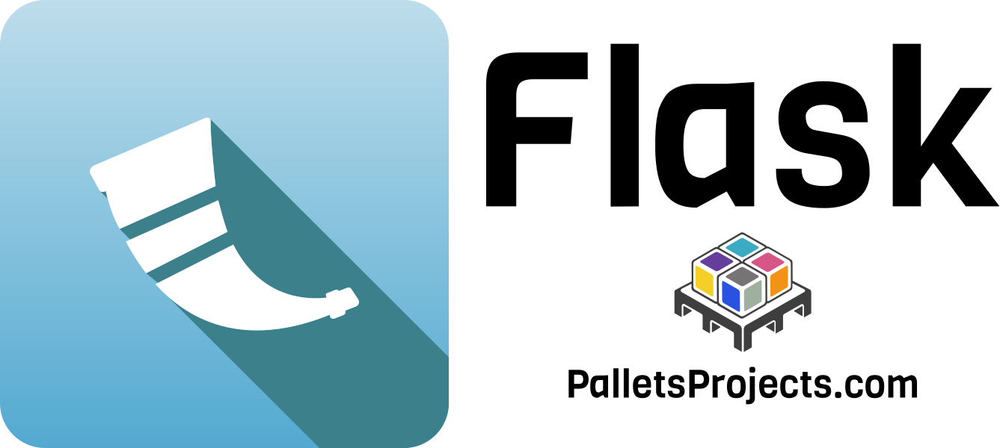

PyBeach is a general Python conference located in the Los Angeles area. It is a welcoming, volunteer-run, community-driven event with the mission to educate and connect its attendees to one another, and promote Python within the local technology community.

PyBeach is a member project of the <a href="https://www.python.org/psf/" title="Python Software Foundation">Python Software Foundation</a>.

## **CFP Is Now Open through June _8th_**

Please read through the [guidelines](/speak.html) before submitting a talk. Note: due to a clerical error, we accidentally closed the submission time _before_ AOE on June 7th. Thus, we have extended the period until June 8th, AOE (and we got the time-zone correct this time!).

## **Volunteers Needed**

PyBeach is a [volunteer-run](/volunteer.html) event, which means we rely exclusively on members of the community to offer their time and talents to make things happen!

## **Early Bird Tickets On Sale Now**

Early bird ticket registration open right now. [Claim your ticket today!](https://ti.to/pybeach/pybeach2026).

## **Date and Venue**

PyBeach 2026 will take place on October 24, 2026, at the [Illusion Magic Lounge](https://illusionmagiclounge.com/) in [Santa Monica, California](/attend.html#location).

## **Sponsors**
Thank you to our [sponsors](/sponsors.html) who are helping put on this event.

  

If you are interested in [sponsoring us](/prospectus.html), please contact us at [sponsors@pybeach.org](mailto:sponsors@pybeach.org).

## **Mailing List**

For ongoing updates please subscribe to the <a href="https://buttondown.com/pybeach" title="PyBeach Announcements">mailing list</a>:

<form action="https://buttondown.com/api/emails/embed-subscribe/pybeach" method="post" target="popupwindow" onsubmit="window.open('https://buttondown.com/pybeach', 'popupwindow')" class="embeddable-buttondown-form">
    <input type="email" name="email" id="bd-email" placeholder="you@example.com" />
    <input type="submit" value="Subscribe" />
</form>

You can also follow us on:

- Mastodon/Fediverse: [@pybeach@fosstodon.org](https://fosstodon.org/@pybeach)
- Bluesky: [@pybeach.bsky.social](https://bsky.app/profile/pybeach.bsky.social)

If you want to get in touch with us, the best way to do so is by emailing [hello@pybeach.org](mailto:hello@pybeach.org).
