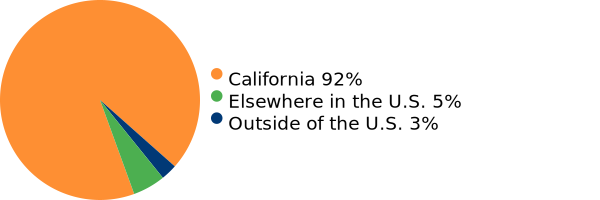
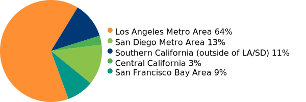
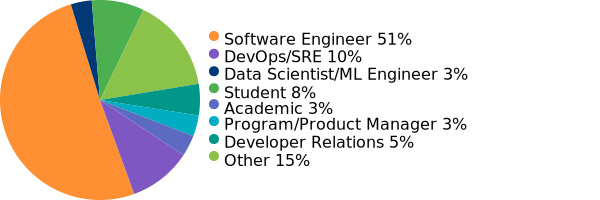
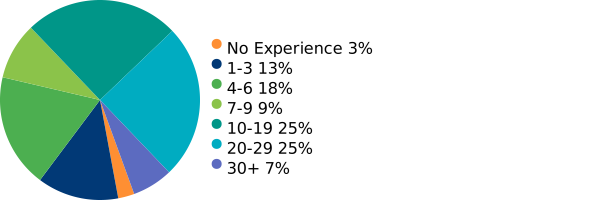

## **Sponsorship Prospectus**

PyBeach 2026 will be a single-track, one-day conference. We expect to welcome an audience of roughly 150 Python professionals, enthusiasts, and students, primarily from the Los Angeles area and the rest of Southern California.

Partnering with us will help us pay for our venue and provide a better venue experience for our attendees, provide financial aid to cover ticket prices for students and unemployed attendees. Surplus revenue from PyBeach will also be used to help run local Python user groups and events. If you are interested in sponsoring our event, please contact us at [sponsors@pybeach.org](mailto:sponsors@pybeach.org).

### **Sponsorship Tiers**

|  | Platinum | Gold | Silver | Bronze | Individual |
| ---- | ----- | ----- | ----- | ----- | ----- |
| Availability | 2 | 5 | Unlimited | Unlimited | Unlimited |
| Cost | $5000 | $2500 | $1000 | $500 | $250 |
| Complimentary Passes | 6 | 4 | 2 | 1 | 1 |
| Logo and acknowledgement on Website | ✓ | ✓ | ✓ | ✓ | ✓ |
| Message On Website [\*](#caveat) | 300 words max | 200 Words max | 100 Words max | 50 Words max | 50 Words max |
| Logo on stage (size adjusted by tier) | ✓ | ✓ | ✓ |  |  |
| Acknowledgement in Opening and Closing Remarks | Logo on dedicated slides | Logo with other Gold sponsors | Logo with other Silver sponsors | Logo with other Bronze and Individual sponsors | Logo with other Bronze and Individual sponsors |
| Informational address to attendees [\*](#caveat) | ✓ |  |  |  |  |

### **Add-On Packages**
In addition to general support, you can make a more direct impact on our event by sponsoring these specific add-ons and amenities.

#### **Videography Sponsor**
* Availability: 1
* Cost: $2000 (only available to sponsors at Silver level or above)
* Pay for professional services to capture, edit, and post the day's presentations.
* Benefits: Your logo will feature on the intro card for each video when posted online.

#### **Conference Lanyard Sponsor**
* Availability: 1 (only available to sponsors at Silver level or above)
* Cost: $1000
* Help us pay for the cost of badges and check-in for our attendees.
* Benefits: Your logo will be displayed on every participant's badge and lanyard.

#### **Financial Aid Sponsor**
* Availability: Unlimited
* Cost: $500
* Provide complimentary or reduced-price tickets, travel, and/or accomodations to students or other attendees who request financial aid.
* Benefits: Attendees whose tickets are complimentary via financial aid will be informed of which sponsor(s) enabled their free attendance. We will also include a special recognition for financial aid sponsors on our website.

### **Custom Sponsorship Packages**
We are open to other benefits. If you have any other ideas on how you can help make our conference better, please drop us a line at [sponsors@pybeach.org](mailto:sponsors@pybeach.org).

\* We reserve the right to reject any sponsored talk or website messaging which might jeopardize the 501(c)(3) status of the PSF, or that is not of relevance to the Python community. All talks and website messages must be submitted for approval at least one month before the conference date.

## **PyBeach 2025 Demographics**

Last year we welcomed roughly 100 attendees. Here are some break-downs of our attendance statistics.

### **Attendee Location**
The vast majority of our attendees came from Southern California, a few from Central and Northern California, and a very small handful from elsewhere.

### **California attendee locations**
A more detailed breakdown of the specific locations within California our attendees came from.

### **Attendee Roles**
Most of our attendees are Software Engineers, but we had an mix of many different roles. The 'Other' category includes senior leadership roles, hobbyists and retirees.

### **Attendee Experience**
The Python experience levels of our attendees was varied, with more than half having at least 10 years of experience with Python.

